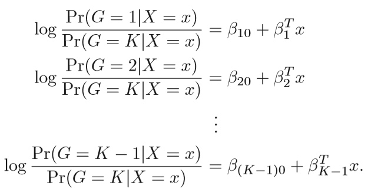

# ESL

## Overview of Supervised Learning
两种常见方法：
+ **线性模型** ，最小平方和
  假定了 `Y~X` 的线性关系
+ **最小紧邻(NN)**
  不需要假定关系，认为在近邻内，X是为常数的，因此近邻可以代表X
  + **维度灾难**
    1.立方体中要运用 `1/1000` 的数据空间，以及覆盖 `1/10` 的数据
    2.若 `N=100` 代表了一个稠密的 **1维** 输入空间，在 **10维** 时，需要 `100^10` 个数据点才能达到相同密度的输入空间，因此，高维时数据通常是 **稀疏的**
  + 在已知 **Y~X** 关系时不是最佳选择

三个概念：
+ `Statistical Models` 具有统计意义的模型比如，$Y=f(X)+\epsilon$ 利用残差项的分布假设
+ `Supervised Learning` 监督式学习是通过一个 `teacher` 的监督下利用 `Learning Algorithm` 不断根据 $y_i-f(x_i)$ 来修正自己
+ `Function Approximation` $f_\theta(x)=\sum\limits_{k=1}^{K}h_k(x)\theta_k$
  估计了一系列 $h_k(x)$ 的系数 $\theta_k$，

`Roughness Penalty`
+ 函数 `f` 不平滑，在某些区域变化非常快，则 `RSS` 会变成 `PRSS` 即对函数 `f` 施加惩罚，比如对二阶导数施加惩罚
  $PRSS(f;\lambda) = RSS(f)+\lambda \int[f^{''}(x)]^2dx$

`Kernal function`
+ $K_\lambda(x_0,x)$， 对 $x_0$ 附近的点 $x$ 赋予权重

`Bias-Variance Tradeoff`
随着模型复杂度提高，**误差变小，方差提高**
+ 对于 **训练集** 而言，模型复杂度提高，**预测偏差肯定会下降**
+ 对于 **测试集** 而言并非如此，预测偏差 **先下降后提高**，原因是 **过拟合**
找到 **测试集预测偏差最小** 的模型是非常关键的

## Linear Methods for Regression
### Least Squares
+ $RSS(\beta)=(y-X\beta)^T(y-X\beta)$
+ 矩阵求一阶导 (纵向扩展)
$\dfrac{dRSS}{d\beta}=-2X^T(y-X\beta)$
+ $\beta'=(X^TX)^{-1}X^Ty$
+ $Var(\beta')=(X^TX)^{-1}\sigma^2$
注意向量的 `Var` 会得到一个协方差矩阵 $Var(U\beta)=UU^T\beta$ 对角线元素才是每个值得方差

**统计推断**
+ $z_j=\dfrac{\hat{\beta_j}}{\hat{\sigma}\sqrt{v_j}}$ 其中 $v_j$ 是第 j 个对角元素
+ $F=\dfrac{(RSS_0-RSS_1)/(p_1-p_0)}{RSS_1/(N-p_1-1)}$

高斯-马可夫定理说明在所有无偏的估计量里面，最小二乘法得到的估计量的方差是最小的。但这个方差对于我们而言还是可能有点大，导致预测不准确，因此我们会做出一个 `bias-variance tradeoff` ，我们会牺牲无偏去换取更小的方差。

### Subset Selection
只选取变量集的某一部分来进行回归，即便系数有偏，但方差更小，

+ Best-Subset Selection
遍历所有可能的变量子集，选取最好的子集，这在变量多的时候就不可行了。判断标准可以是 `AIC`
+ Forward- and Backward-Stepwise Selection
**贪心算法**，每次选取最好的（系数方差最小的）变量进入模型。

### Shrinkage Method

#### 岭回归
对传统的RSS施加乘法后再进行优化。有两种形式，可以用 **拉格朗日算子** 相互转化。
新的 `RSS` 为：
+ $RSS(\lambda)=(y-X\beta)^T(y-X\beta)+\lambda\beta^T\beta$
+ 可以算出 $\hat{\beta}^{ridge}=(X^TX+\lambda I)^{-1}X^Ty$ 这也是最初岭回归的初衷，是为了处理 X 为奇异矩阵的情况 `rank(X)<n`，通过这个变换可以变成非奇异矩阵 `rank(x)=n`
+ 当 `X` 为正交标准化后的矩阵时 $X^TX=I$
$\hat{\beta}^{ridge}=\hat{\beta}/(1+\lambda)$

要求自由度的话，先做 **奇异值分解SVD**
+ $X = UDV^T$ 其中D是 `M*N` 阶对角矩阵
+ $df(\lambda)=tr[X(X^TX+\lambda I)^{-1}X^T]$
+ $=\sum\limits^{p}_{j=1}\dfrac{d^2_j}{d^2_j+\lambda}$
+ `U` 和 `V` 都满足 $UU^T=I,VV^T=I$

#### Lasso
与岭回归稍有不同
+ $\hat{\beta^{lasso}}=\mathop{\arg\min}_{\beta} \sum\limits^{N}_{i=1}(y_i-\beta_0-\sum\limits_{j=1}^{p}x_{ij}\beta_j)^2$
$subject to \sum\limits_{j=1}^{p}|\beta_j| \leq t$
+ 也可以改写成 **拉格朗日算子** 的形式

#### Principal Components Regression
+ $\hat{y}^{pcr}_{(M)}=\bar{y}1 + \sum\limits_{m=1}^{M}\hat{\theta}_mz_m$
$z_m=Xv_m$ 是 `derived inputs`
+ $z_m=Xv_m=Ud_m$
证明：
$X=UDV^T$
$XV=UDV^TV$
$XV=UD$
$Xv_m=Ud_m$

## Linear Method in Classification
+ `discriminant functions` $\delta_k(x)$ ，在这个函数取得最大值时分到这一类

### 简单线性回归
将类别划分为一系列 `indicator`，若有 `K` 类，则是 $N \times K$ 的矩阵 $Y$ 利用线性回归的表达式
+ $\hat Y = X(X^TX)^{-1}X^TY$
+ 得到系数矩阵 $\hat B=(X^TX)^{-1}X^TY$

由特性可知 `indicator` 的和为1

### Linear Discriminant Analysis
在贝叶斯定理下：
+ $Pr(G=k|X=x)=\dfrac{f_k(x)\pi_k}{\sum\nolimits_{l=1}^{K}f_l(x)\pi_l}$

可见，$f_k(x)$ 和 $Pr(G=k|X=x)$ 有一样的能力

`LDA` 对 $f_k(x)$ 做出了多元正太分布的假设。
$f_k(x) = \dfrac{1}{2\pi^{p/2}|\sum_k|^{1/2}}e^{-\frac{1}{2}(x-\mu_k)^T\sum_k^{-1}(x-\mu_k)}$

其中 $\sum_k$ 为 N元 $X_1, X_2, ..., X_N$ 的协方差矩阵，对角元素为 $\sigma_{x_j}^2$

对于 `LDA` ，假设 $\sum_k$ 在各类中是相同的，因此二次项可以通过 $\delta_k(x)$ 相减抵消。

对于 `Quadratic DA` 不能抵消，

### Logistic Regression

可以用最大似然进行估计，利用一阶导和二阶导进行牛顿逼近

可以看到这是一个 `WLS` 估计的过程，这个算法就是迭代的 `WLS` 直到系数收敛，其中
+ $z = X\beta^{old}+W^{-1}(y-p)$
+ $W$ 是一个对角矩阵，对角元素是 $\hat p(1-\hat p)$
