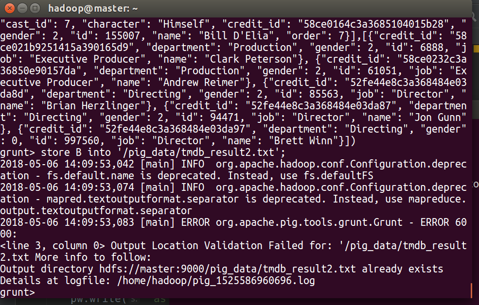

# 第三次上机
## Hadoop
**实验环境**
+ VMware Workstation Pro 12.5.0
+ Ubuntu 16.04.3 LTS
+ Hadoop 2.7.5

**实验问题**
+ `jps` 显示的进程中没有 `datanode` 或 `namenode`
  可能的原因是，用户对 `dataNode` 所在的目录没有写权限，应该确保用户对 `hadoop` 可能需要写入的目录有写权限

**实验结果 Hadoop 正常运行**


## Hbase
**实验环境**
+ hbase-1.2.6

**实验问题**
+ 关闭安全模式，安全模式启动时 `hbase` 无法正常使用
  ```shell
  hdfs dfsadmin -safemode leave
  ```
+ 保证用户在可能写入的地址拥有权限
+ `master` 进程消失
  + 配置 `hostname:master`
  + 配置 `hosts` 文件 `192.168.xxx.xxx:master`
  + 配置 `hbase-site.xml` `core-site.xml` 中都为 `master:9000`  
+ 浏览器访问 `master`
  在 `hbase-site.xml` 中开启 `60010` 端口
  ```xml
  <property>
        <name>hbase.master.info.port</name>
        <value>60010</value>
  </property>
  ```
+ zookeeper异常
  配置 `hbase-site.xml`
  ```xml
      <property>  
        <name>hbase.zookeeper.quorum</name>  
        <value>192.168.238.128</value>  
    </property>  
    <property>
    	<name>hbase.zookeeper.property.dataDir</name>
    <value>/usr/local/hbase/zk_data</value>
    </property>
  ```
**实验结果 Hbase正常运行**


**用java API访问**
+ `main` 函数
  ```java
      public static void main(String[] args) throws Exception{
        hbd = new HBaseDemo();
        String fileNameMovies = "tmdb_5000_movies.csv";
        String fileNameCredits = "tmdb_5000_credits.csv";

        readAndInsert(fileNameMovies);
         readAndInsert(fileNameCredits);

        hbd.get("tmdb_5000_movies", 1, "budget");
    }
  ```
  
  **API 接口访问正常**

+ `HBaseDemo`类的 `createTable` 函数
  ```java
      public void createTable(String tablename,String... cf1) throws Exception{
        //获取admin对象
        admin = connection.getAdmin();
        //创建tablename对象描述表的名称信息
        TableName tname = TableName.valueOf(tablename);//bd17:mytable
        //创建HTableDescriptor对象，描述表信息
        HTableDescriptor tDescriptor = new HTableDescriptor(tname);
        //判断是否表已存在
        if(admin.tableExists(tname)){
            System.out.println("表"+tablename+"已存在");
            return;
        }
        //添加表列簇信息
        for(String cf:cf1){
            HColumnDescriptor famliy = new HColumnDescriptor(cf);
            tDescriptor.addFamily(famliy);
        }
        //调用admin的createtable方法创建表
        admin.createTable(tDescriptor);
        System.out.println("表"+tablename+"创建成功");
    }
  ```
+ `readAndInsert` 函数
  ```java
  public static void readAndInsert(String filename) throws Exception{
        try{
            // create csv
            CsvReader csvReader = new CsvReader(filename);
            // read header
            csvReader.readHeaders();
            String[] headers = csvReader.getHeaders();

            // create table and connect
            hbd.createTable(filename.split("\\.")[0]);
            hbd.connnectTable(filename.split("\\.")[0]);

            int rowKey = 0;
            while(csvReader.readRecord()){
                hbd.putData(headers, csvReader.getValues(), rowKey);
                rowKey++;
            }

        }catch (IOException ex){
            System.err.println(ex.getMessage());
        }

        System.out.println("Insert Compelte!");
    }
  ```

## Hive
**实验环境**
+ hive-1.2.2
+ mysql-connector-java-5.1.30

**实验问题**
+ `hive shell` 执行 `drop table` 报错
  `mysql-connector-java-5.0.8` 版本不匹配，更换成 `mysql-connector-java-5.1.30` 正常运行
+ 开启远程连接
  ```shell
  hive --service metastore
  hive --service hiveserver2
  ```
+ 直接导入 `.csv` 文件，在建表的时候使用 `OpenCSVSerde`
  ```sql
  CREATE EXTERNAL TABLE example (
   organization  STRING,
   order BIGINT,
   created_on  TIMESTAMP,
   issue_date TIMESTAMP,
   qty  INT
  )
  ROW FORMAT SERDE 'org.apache.hadoop.hive.serde2.OpenCSVSerde'
  WITH SERDEPROPERTIES (
    "separatorChar" = "\t",
    "quoteChar"     = "'"
  )  
  ```
+ `load` `.csv` 文件时去除 `.csv` 的 `headers` 否则进行查询操作时报错

**实验结果 Hive正常运行**

**Hive Java API**
+ `main()`
  ```java
    public static void main(String[] args) throws Exception{
        Connection conn = null;
        Statement stmt = null;
        String fileNameMovie = "tmdb_5000_movies.csv";
        String fileNameCredits = "tmdb_5000_credits.csv";
        String fileTest = "test.csv";
        String file = fileNameMovie;
        HiveDemo hd = new HiveDemo();
        try{
            conn = hd.getConn();
            stmt = conn.createStatement();
            // connect mysql

            CsvReader csvReader = new CsvReader(file);
            String tableName = file.split("\\.")[0];
            // read file
            csvReader.readHeaders();
            String[] headers = csvReader.getHeaders();
            csvReader.readRecord();
            String[] firstLine = csvReader.getValues();

            // jdbc
            // drop table
            hd.dropTable(stmt, tableName);
            // create table
            hd.createTable(stmt, tableName, headers, firstLine);
            // show tables
            hd.showTables(stmt, tableName);
            String filepath = "/home/hadoop/Desktop/HiveDemo/nohead_" + file;
            // load csv
            hd.loadData(stmt, tableName, filepath);
            // table head
            hd.tableHead(stmt, tableName, headers.length);
            // simple query
            hd.selectData(stmt,tableName, headers.length, "budget1", "300000000");
        }catch (ClassNotFoundException e) {
            e.printStackTrace();
            System.exit(1);
        } catch (SQLException e) {
            e.printStackTrace();
            System.exit(1);
        } finally {
            try {
                if (stmt != null) {
                    stmt.close();
                }
                if (conn != null) {
                    conn.close();
                }
            } catch (SQLException e) {
                e.printStackTrace();
                System.exit(1);
            }
        }
    }
    ```
  
+ `loadData` 函数
    ```Java
     public void loadData(Statement stmt, String tableName, String filepath)
            throws SQLException {
        StringBuilder sb = new StringBuilder();
        sb.append("load data local inpath '" + filepath);
        sb.append("' into table " + tableName);

        sql = sb.toString();
        System.out.println("Running:" + sql);
        stmt.execute(sql);
        System.out.println("Success!");
    }
    ```
+ `createTable` 函数
  ```Java
      public void createTable(Statement stmt, String tableName, String[] headers, String[] firstLine)
            throws SQLException {

        StringBuilder sb = new StringBuilder("(");
        for(int i=0; i<headers.length; ++i){
            sb.append(headers[i] + "1");
            if(firstLine[i].matches("^[0-9]+$"))
                sb.append(" int, ");
            else
                sb.append(" string, ");
        }

        String state = sb.toString();
        state = state.replaceAll(",\\s$", ")");


        sql = "create table "
                + tableName
                + " " + state
                + " ROW FORMAT SERDE 'org.apache.hadoop.hive.serde2.OpenCSVSerde'\n";
               // + "WITH SERDEPROPERTIES (\n"
               // + "   \"quoteChar\"     = \"\\\"\"\n"
               // + ")  ";
        System.out.println("Running:" + sql);
        stmt.execute(sql);
        System.out.println("Table Created: " + tableName);
    }
    ```

## Pig
**实验环境**
+ pig-0.16.0

**实验问题**
+ `Pig` 有自己的脚本 `.pig` 文件，可以利用这个脚本进行插入查询等操作

**利用java生成脚本文件**
+ `main()`
  ```Java
  public static void main(String[] args) throws Exception{
        CsvReader csvReader = new CsvReader("tmdb_5000_credits.csv");

        csvReader.readHeaders();
        String[] headers = csvReader.getHeaders();

        csvReader.readRecord();
        String[] records = csvReader.getValues();

        for(int i=0; i<headers.length; ++i){
            System.out.println(String.format("%s : %s", headers[i], records[i]));
        }

        StringBuilder sb = new StringBuilder("(");
        for(String s : headers){
            sb.append(s);
            sb.append(":chararray, ");
        }
        String state = sb.toString();
        state = state.replaceAll(",\\s$", ")");
        System.out.println(state);

        StringBuilder sb1 = new StringBuilder();
        for(String s : headers){
            sb1.append(s + ", ");
        }
        String state1 = sb1.toString();
        state1 = state1.replaceAll(",\\s$", "");
        System.out.println(state1);

        String filename = "pigScriptCredits.pig";
        PrintWriter pw = new PrintWriter(filename);
        pw.write("A = load '/pig_data/tmdb_data/tmdb_5000_credits.csv'");
        pw.write(" using org.apache.pig.piggybank.storage.CSVExcelStorage()");
        pw.write(" as " + state + ";\n");
        pw.write("B = foreach A generate");
        pw.write(" " + state1 + ";\n");
        pw.write("dump B;\n");
        pw.write("store B into '/pig_data/tmdb_result2.txt';\n");
        pw.flush();
        pw.close();
    }
  ```
+ 在 `Pig shell` 中运行脚本
  ```shell
  grunt> run pigScriptCredits.pig
  ```
  
