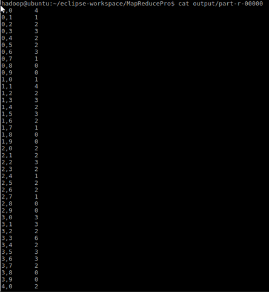

# 第五次上机实验报告
冯存光：1500012904
阳磊：1500015877

## 矩阵乘法
1. 用 `mapreduce` 实现矩阵乘法的关键在于分析乘积矩阵C中的每个元素是由A和B中的哪些元素相乘然后相加得到的。
2. 在 `map` 阶段根据文件名是A还是B。把来自矩阵A的元素aij，标识成p条 `<key, value>` 的形式，`key="i,k",（k=1,2,...,p），value="a,j,aij”`
3. 把来自矩阵B的元素bij，标识成m条 `<key, value>` 形式，`key="k,j"（k=1,2,...,m），value="b,i,bij"`
4. 这样一来，计算cij需要的A和B中的元素就转变为有相同 `key（"i,j"）` 的数据对，其 `value` 被分到同一个 `Iterable` 中，把其中来自A的和来自B的对应的元素对相乘，然后相加得到cij的值。


```
public void map(LongWritable key, Text value, Context context) throws IOException, InterruptedException {
			String fileName = ((FileSplit) context.getInputSplit()).getPath().getName();
			String[] tokens = value.toString().split(",");
			if (tokens.length != 3) {
				System.out.println("len error");
				return;
			}
			int i, j, e;
			try {
				i = Integer.parseInt(tokens[0]);
				j = Integer.parseInt(tokens[1]);
				e = Integer.parseInt(tokens[2]);
			} catch (NumberFormatException e_) {
				System.out.println("Integer cast error");
				return;
			}
			if (e == 0)
				return;
			if (fileName.equals("A")) {
				String va = "a," + j + "," + e;
				for (int k = 0; k < p; k++) {
					String ke = i + "," + k;
					context.write(new Text(ke), new Text(va));
				}
			} else if (fileName.equals("B")) {
				String va = "b," + i + "," + e;
				for (int k = 0; k < m; k++) {
					String ke = k + "," + j;
					context.write(new Text(ke), new Text(va));
				}
			} else {
				System.out.println("fileName error");
			}
		}

		public void reduce(Text key, Iterable<Text> values, Context context) throws IOException, InterruptedException {
			Map<Integer,Integer> map = new HashMap<Integer, Integer>();
			int sum = 0;
			for (Text val : values) {
				String[] tokens = val.toString().split(",");
				if (tokens.length != 3) {
					System.out.println("len error");
					break;
				}
				int ij, e;
				try {
					ij = Integer.parseInt(tokens[1]);
					e = Integer.parseInt(tokens[2]);
				} catch (NumberFormatException e_) {
					System.out.println("Integer cast error");
					return;
				}
				if(map.containsKey(ij)) {
					sum+=e*map.get(ij);
					map.remove(ij);
				}else {
					map.put(ij, e);
				}
			}

			context.write(key, new Text(" " + sum));
		}
```

## PageRank

### PageRank一次迭代
利用预处理之后的文件，并应用MapReduce乘法算法，进行一次迭代。
其中 `PageRank` 的 `Mappper` 部分如下：
```
public static class TokenizerMapper extends Mapper<LongWritable, Text, Text, Text> {
	public void map(LongWritable key, Text value, Context context) throws IOException, InterruptedException {
		System.out.println(value.toString());
		String[] tokens = value.toString().split("\t");
		int firstComma = tokens[1].indexOf(',');
		if (firstComma <= 0) {
			return;
		}
		String rankStr = tokens[1].substring(0, firstComma);
		String linksStr = tokens[1].substring(firstComma + 1);
		String[] linksto = linksStr.split(",");
		String url = tokens[0].trim();
		float rank;
		try {
			rank = Float.parseFloat(rankStr);
		} catch (NumberFormatException e_) {
			System.out.println("Float cast error" + rankStr);
			return;
		}
		rank /= linksto.length;
		for (String u:linksto) {
			context.write(new Text(u), new Text("" + rank));
		}
		context.write(new Text(url), new Text("," + linksStr));
	}
}
```
`Reducer` 部分代码如下
```
public static class MmSumReducer extends Reducer<Text, Text, Text, Text> {

	public void reduce(Text key, Iterable<Text> values, Context context) throws IOException, InterruptedException {
		String linksStr = "";
		float sum = 0;
		for (Text val : values) {
			String valStr = val.toString();
			if (valStr.charAt(0) == ',') {
				linksStr = valStr;
			} else {
				float valFloat;
				try {
					valFloat = Float.parseFloat(valStr);
				} catch (NumberFormatException e_) {
					System.out.println("Float cast error" + valStr);
					continue;
				}
				sum += valFloat;
			}
		}
		float newRank = sum * d + (1 - d) / N;
		context.write(key, new Text(newRank + linksStr));
	}
}
```

### PageRank反复迭代
由于一次 `mapreduce` 只能运算一次，为了实现反复迭代，采用迭代式的 `mapreduce`。将前一次 `mapreduce` 产生的 `output` 文件作为后一次 `mapreduce` 的 `intput` 文件。并每次计算两个文件的差别，在差别达到目标精度 `precision` 时或达到最大迭代次数时停止迭代。

比较两个文件的代码如下：
```
public static ArrayList<Float> readList(FileSystem fs, Path p) throws Exception{
	BufferedReader file = new BufferedReader(new InputStreamReader(fs.open(p)));
	ArrayList<Float> l = new ArrayList<>();
	String line = file.readLine();
	while(line != null) {
		line = line.split("\t")[1];
		Float f = Float.parseFloat(line.split(",")[0]);
		l.add(f);
		line = file.readLine();
	}
	return l;
}

public static float distance(ArrayList<Float> l1, ArrayList<Float> l2) {
	float f = 0;
	for(int i=0; i<l1.size();++i) {
		f += (l1.get(i) - l2.get(i)) * (l1.get(i) - l2.get(i));
	}
	return f;
}

public static boolean compare(FileSystem fs, Path p1, Path p2, float precision) throws Exception{
	ArrayList<Float> l1 = readList(fs, p1);
	ArrayList<Float> l2 = readList(fs, p2);
	float f = distance(l1, l2);
	return f < precision;
}
```

迭代的主循环代码如下：
```
for(int i=0; i<7; i++) {
	System.out.println("task:" + Integer.toString(i));
	Job job = new Job(conf, "word count");
	job.setJarByClass(PageRank.class);
	job.setMapperClass(TokenizerMapper.class);
	job.setReducerClass(MmSumReducer.class);
	job.setMapOutputKeyClass(Text.class);
	job.setMapOutputValueClass(Text.class);
	job.setOutputKeyClass(Text.class);
	job.setOutputValueClass(Text.class);

	// input, output
	FileInputFormat.addInputPath(job, input);
	FileOutputFormat.setOutputPath(job, output);

	job.submit();
	while(!job.isComplete()) continue;
	job.killJob();

	boolean b = compare(fs, pi, po, 0.01f);
	System.out.println(b);
	if(b)
		break;

	// move file		
	FileUtil.copy(fs, po, fs, pi, true,true,conf);
	fs.delete(output, true);
}
```
