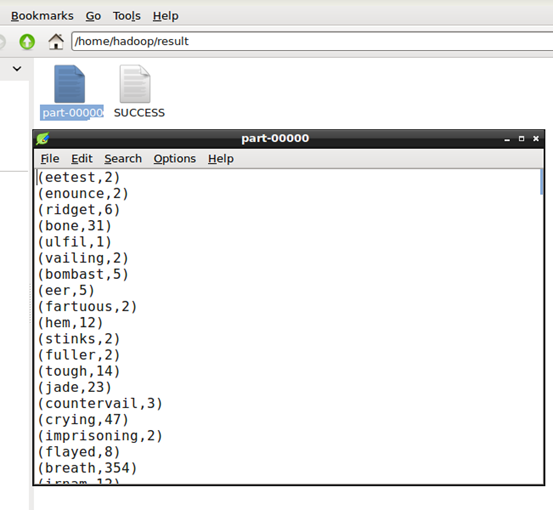
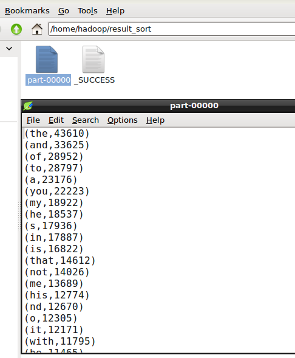
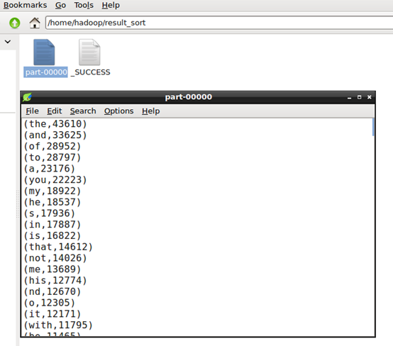
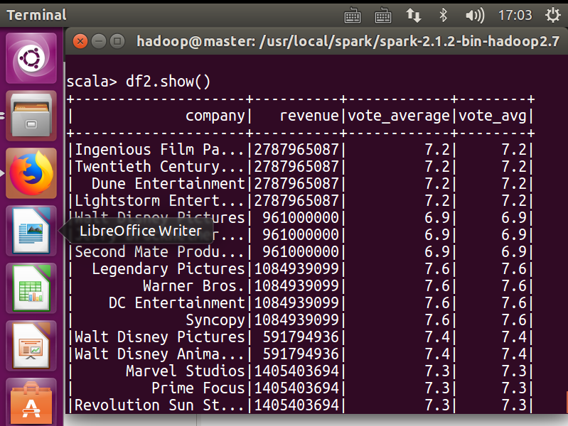
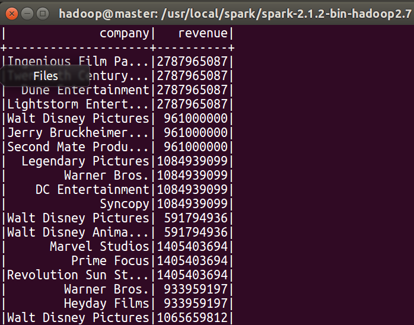

# 第六次上机实习

## WordCount

读入文本文件

```js
val lines =sc.textFile("file:///home/hadoop/Shakespeare.txt")
```

因为最终只统计英文单词的次数，需要去除其它字符，只留下英文字符，所以将每行按非英文字母分割即可，split函数支持正则表达式，然后把空字符串过滤掉，然后每个单词映射为(单词, 1)键值对，然后用.reduceByKey把相同键的值相加得到每类单词和其出现的次数：

```js
val wordCount=lines.flatMap(line => line.split("[^a-z]")).filter(word =>
              !word.isEmpty()).map(word=>(word,1)).reduceByKey((a, b) => a
              + b)
```

保存结果：

```js
wordCount.saveAsTextFile("file:///home/hadoop/result")
```

结果截图：



可以按照单词出现的次数从大到小排序：

```js
val  lines =sc.textFile("file:///home/hadoop/Shakespeare.txt")
val  wordCount=lines.flatMap(line => line.split("[^a-z]")).filter(word =>
              !word.isEmpty()).map(word=>(word,1)).reduceByKey((a, b) => a
              + b).sortBy(_._2,false)
wordCount.saveAsTextFile("file:///home/hadoop/result_sort")
```

结果截图：





## Spark-SQL

读取文件，使得读入得文件有文件头。

```js
import org.apache.spark.sql.SparkSession
val spark=SparkSession.builder().getOrCreate()
import spark.implicits._
val df = spark.read.format("csv").option("header","true").
         load("file:///home/hadoop/Desktop/tmdb_data/data.csv")
df.printSchema()
```

对列的格式进行转换，否则都是字符串，不方便筛选

```js
// 读入后为列格式不对，为字符串
import org.apache.spark.sql.functions._
val toBIgInt = udf[Long, String]( _.toLong)
val toDouble = udf[Double, String]( _.toDouble)

val df1 = df.withColumn("vote_avg",
          toDouble(df("vote_average"))).withColumn("revenue",
          toBigInt(df("revenue")))
```

筛选及结果

```js
val df2 = df1.where("vote_avg > 6.5")
val df3 = df2.select("company", "revenue")
```



汇总及结果

```js
df3.groupBy("company").agg(sum($"revenue"))
```


