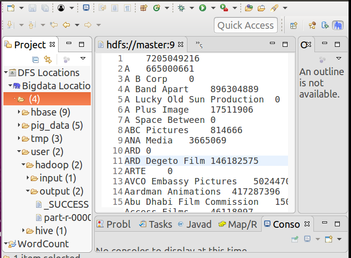

# 第四次上机报告

## MapReduce
### mapper
+ 由于票房数超出了 `Integer` 的范围，因此使用 `Text` 类包装票房数。从而 `mapper` 的 `key-value` 映射是从 `Text` 到 `Text`
+ 使用正则表达式对 `.csv` 文件的每一行进行切分，取出要使用的3个值 `production_companies`， `revenue`， `vote_average`
+ 用正则表达式选出每一个参与制作的公司

```java
public static class TokenizerMapper
      extends Mapper<Object, Text, Text, Text>{
  private Text company = new Text();
  private Text revenue = new Text();
  public void map(Object key, Text value, Context context
                  ) throws IOException, InterruptedException {
    String line = value.toString();
    String[] splits = line.split(",(?=([^\\\"]*\\\"[^\\\"]*\\\")*[^\\\"]*$)");
    if(splits.length != 20)
  	  return;
    try {
  	  if(splits[18]=="" || Double.parseDouble(splits[18]) < 6.5)
  	  return;
    } catch(NumberFormatException nfe) {
  	  return;
    }

    revenue.set(splits[12]);
    String companies = splits[9];
    Pattern p = Pattern.compile("(?<=name\"\":\\s\\\"\\\")[a-zA-Z\\s]*");
    Matcher m = p.matcher(companies);

    while(m.find()){
        company.set(m.group());
        context.write(company, revenue);
    }
  }
}
```

### Reducer
+ 将字符串形式的票房当作 `BigInteger` 处理，进行求和操作

```java
public static class SumReducer
      extends Reducer<Text,Text,Text,Text> {
  private Text result = new Text();
  public void reduce(Text key, Iterable<Text> values,
                      Context context
                      ) throws IOException, InterruptedException {
    BigInteger sum = new BigInteger("0");
    for (Text val : values) {
  	BigInteger bi = new BigInteger(val.toString());
      sum = sum.add(bi);
    }
    result.set(sum.toString());
    context.write(key, result);
  }
}
```
## 实验结果


成功输出到文件中。其中 `key` 为公司名称， `value` 为票房总数。
